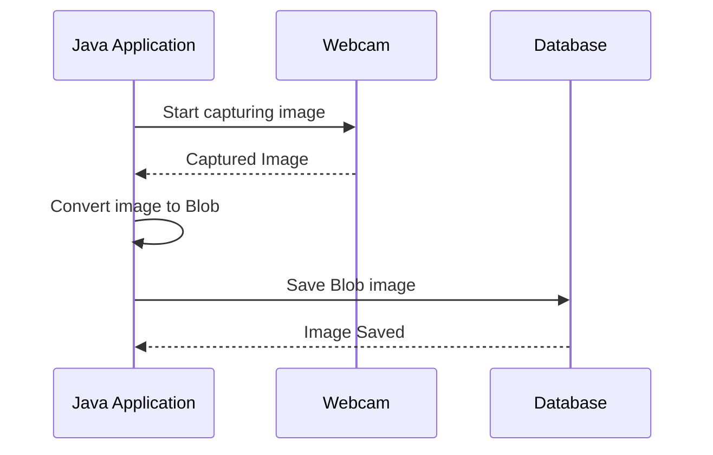

### JMF Photo DB

JMF application that take photos from your webcam and store in database as a BLOB file.



### Usage

```shell
mvn package
java -jar target/photo-db-1.0-jar-with-dependencies.jar <cod_inst> <rgm_alun>
```
