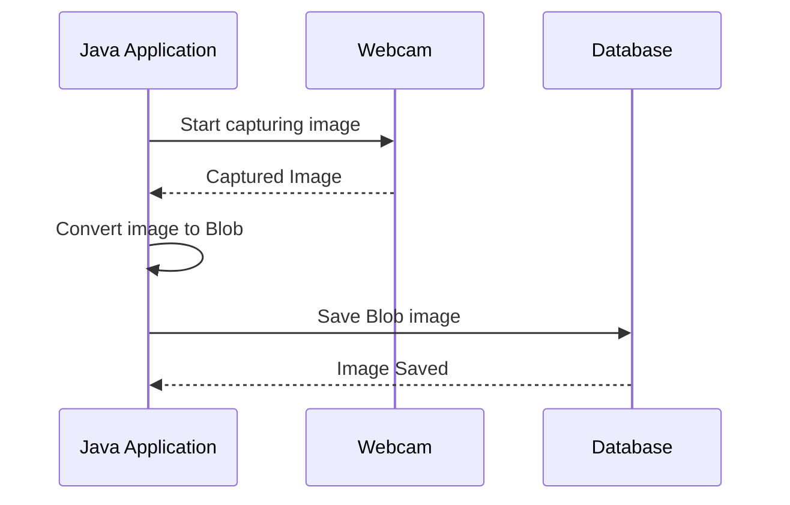

### JMF Photo DB

JMF application that establishes a connection with your webcam, captures an instant photo, converts it into a blob, and then persists it into a database.



### Usage

```shell
mvn package
java -jar target/photo-db-1.0-jar-with-dependencies.jar <cod_inst> <rgm_alun>
```