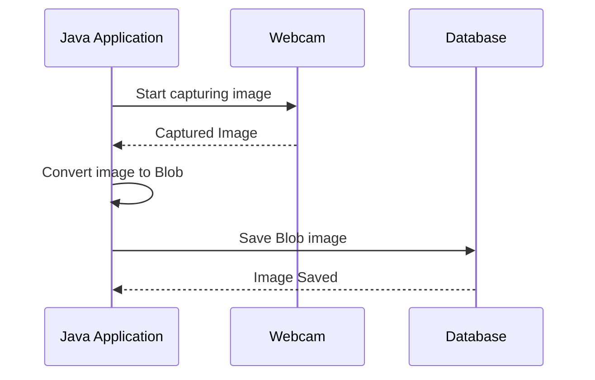

### JMF Photo DB

JMF application that take photos from your webcam and store in database as a BLOB file.

Requirement
[Java Media Framework](https://www.oracle.com/java/technologies/javase/java-media-framework.html)




### Usage

```shell
./mvnw package
COD_INSTITUICAO=1
RGM_ALUNO=123456789
java -jar target/photo-db-1.0-jar-with-dependencies.jar $COD_INSTITUICAO $RGM_ALUNO
```

## Db Configuration
At [src/main/resources/connection.properties](src/main/resources/connection.properties)
```
jdbc.driver=org.h2.Driver
jdbc.user=sa
jdbc.pass=
jdbc.url=jdbc:h2:file:~/java-photo-db
```
